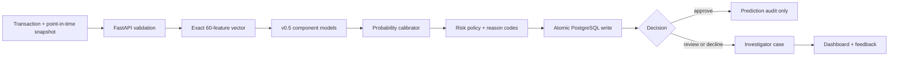
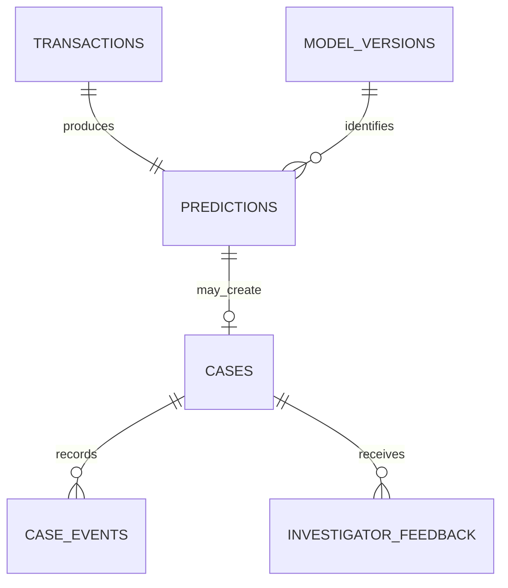

# SentinelGraph v0.6 architecture

## Request and decision flow

## Boundaries

The caller or future online feature store owns strictly-prior account and graph
state. FastAPI owns current-event derivation, exact feature ordering, artifact
validation, model inference, decision policy, idempotency, and audit writes.
PostgreSQL owns durable cases and human feedback. The dashboard is read/write
only through authenticated API operations.

This split prevents the API from silently replacing unavailable history with
zeroes. It also makes the feature provider independently replaceable as long as
it satisfies `v0.6.0` and the same point-in-time semantics.

## Data model

- `transactions` stores the canonical payload hash, pseudonyms, and feature
  snapshot, but never raw account identifiers.
- `predictions` stores score, policy output, evidence, latency, and all versions.
- `cases` stores queue status, priority, assignment, resolution, and lock version.
- `case_events` is an append-only operational audit trail.
- `investigator_feedback` separates labels/notes from mutable case state.
- `model_versions` records the serving tuple and artifact location.

## Failure semantics

- Invalid or temporally unsafe features: HTTP 422, no inference, no write.
- Invalid API key: HTTP 401, no protected data disclosed.
- Oversized request/batch: HTTP 413, no inference.
- Idempotency payload conflict: HTTP 409.
- Stale case version: HTTP 409.
- Database failure: current write rolls back and readiness becomes unavailable.
- Missing, malformed, or checksum-mismatched bundle: startup fails before traffic.

## Scope boundary

v0.6 is application architecture, not the final deployment topology. Docker,
MLflow, CI/CD, distributed rate limiting, load generation under concurrency,
metrics export, and drift monitoring are v0.7 concerns. AWS deployment is v1.0.
